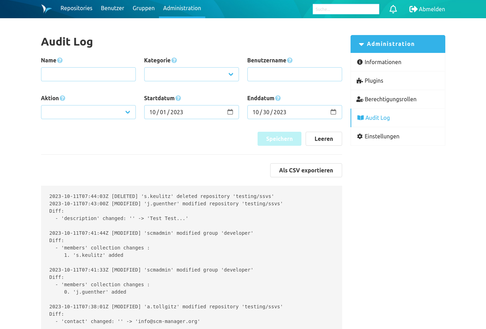
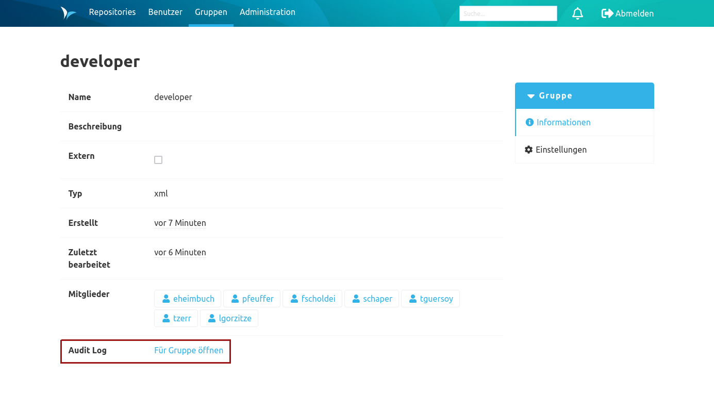

Die Übersicht der Logeinträge befindet sich im Administrations-Bereich unter dem Punkt Audit Log.
Diese unterteilt sich in zwei Bereiche. Zum einen gibt es eine Filtermöglichkeit bestehend aus verschiedenen Feldern. Zum anderen wird, sofern keine Filter gesetzt wurden, eine Gesamtübersicht der Log-Einträge angezeigt. Es werden maximal 100 Einträge pro Seite angezeigt.

Es stehen folgende Filter zur Verfügung:
* Name: Name des veränderten Objekts, z.B. Name eines Repositories oder Name einer Gruppe. Dieser Filter ist unabhängig von Groß- und Kleinschreibung. Sie können das '\*'-Symbol als Wildcard nutzen, um z.B. durch 'namespace/*' alle Repositories in einem 'namespace' genannten Namespace zu selektieren oder mit '*admin' alle Objekte, deren Name auf 'admin' enden.
* Benutzername: Nutzer, der die Veränderung ausgelöst hat. Dieser Filter ist unabhängig von Groß- und Kleinschreibung. Sie können das '\*'-Symbol als Wildcard nutzen, um z.B. durch 'admin*' alle Nutzer zu wählen, die mit dem Bestandteil 'admin' beginnen.
* Kategorie: Kategorie der Änderung
* Startdatum: Einträge ab (einschließlich) dem gewählten Datum
* Enddatum: Einträge bis (einschließlich) zum gewählten Datum
* Aktion: Art der Veränderung

Um zum Beispiel nach allen gelöschten Einträgen in Bezug auf Repositories eines bestimmten Namespaces zu suchen, können folgende Filter gesetzt werden: Name: '&lt;namespace&gt;/*', Kategorie: repository und Aktion: deleted.

Jeder Log-Eintrag besteht aus einem Zeitstempel, gefolgt von der Angabe der ausgeführten Aktion (created, modified, deleted), dem Benutzernamen und der Kategorie. Im Anschluss folgen die jeweiligen Änderungen.

Die Ansicht lässt sich unter Berücksichtigung der Filter als CSV-Datei exportieren. Dabei werden alle protokollierten Einträge gespeichert, es gibt keine Einschränkung bezüglich der Anzahl der Einträge. 

Zusätzlich gibt es die Möglichkeit sich das gefilterte Audit-Log von einzelnen Benutzern, Gruppen und Repositories anzuzeigen. Dafür gibt es in jeder Informations-Seite einen Absprungpunkt.

