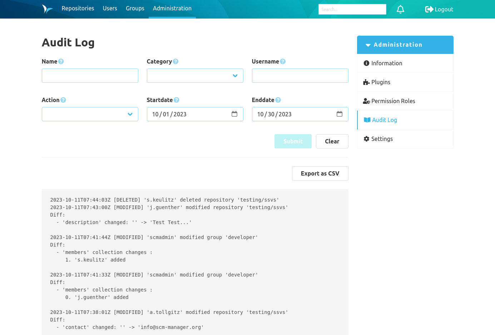
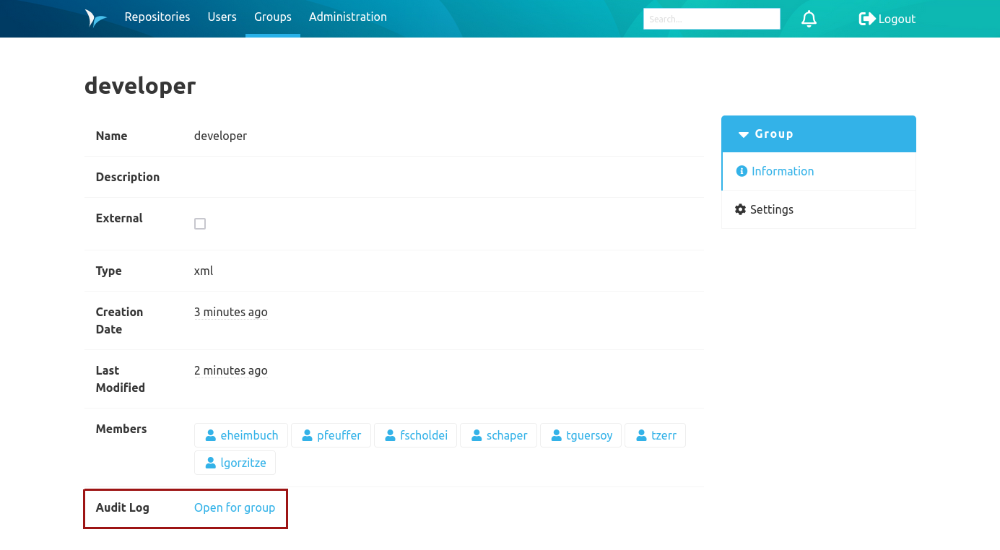

The overview of the log entries is located in the administration area at audit log. 
This is divided into two areas. Firstly, there is a filter option consisting of various fields. Secondly, is a total overview of the log entries, provided that no filters have been set. A maximum of 100 entries per page are displayed.

The following filters are available:
* Name: Name of the changed object, e.g. name of a repository or name of a group. This filter is case-insensitive. You may use the '\*' as a wildcard, e.g. to select all repositories from a namespace called 'namespace' with 'namespace/*' or '*admin' to select all objects that end on 'admin'.
* Username: User who triggered the change. This filter is case-insensitive. You may use the '\*' as a wildcard, e.g. to select any user beginning with admin using 'admin*'.
* Category: Category of change
* Startdate: Entries from (including) the chosen date
* Enddate: Entries until (including) the chosen date
* Action: Type of action

For example, to show all deleted entries for repositories in a certain namespace, the filters can be set to the following: name: '&lt;namespace&gt;/*', category: repository and action: deleted.  

Each log entry consists of a timestamp, followed by the specification of the action performed (created, modified, deleted), the username and the category. This is followed by the respective changes.

The view can be exported as a CSV file, taking the filters into account. Here all related entries are included, there is no limitation in terms of quantity.

In addition, it is possible to display the filtered audit log of individual users, groups and repositories. There is a jumping point for this in each information page.

